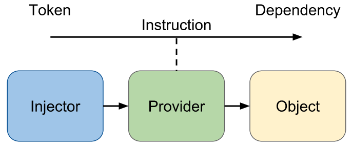
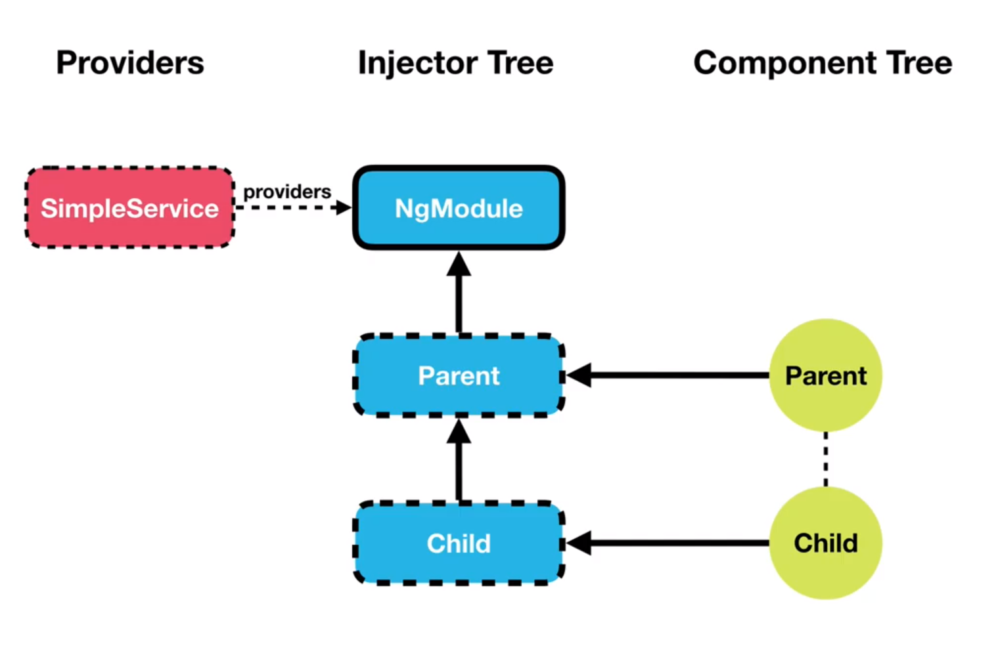
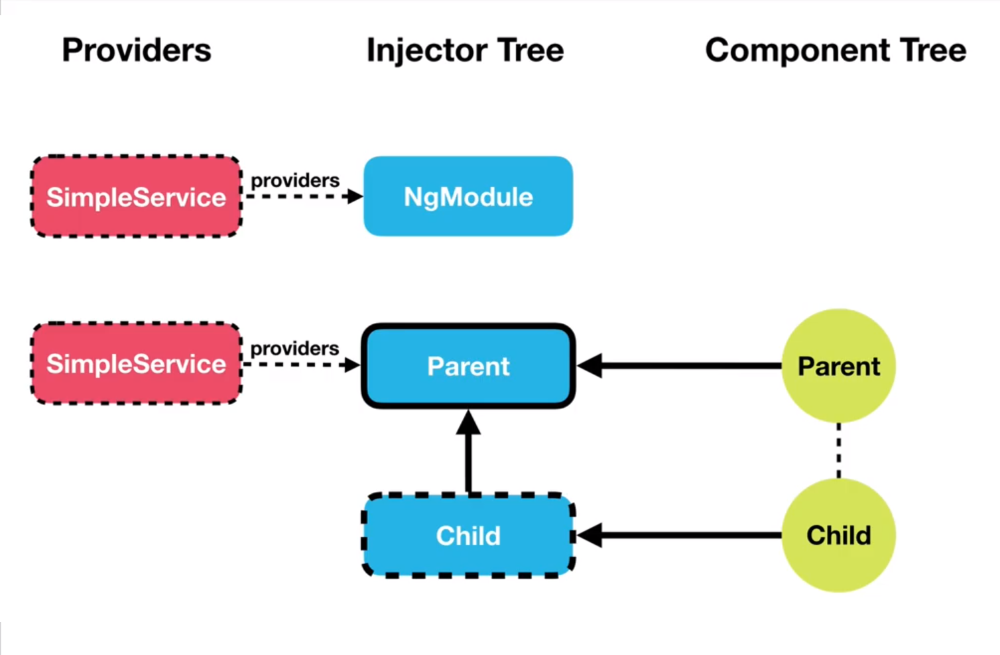
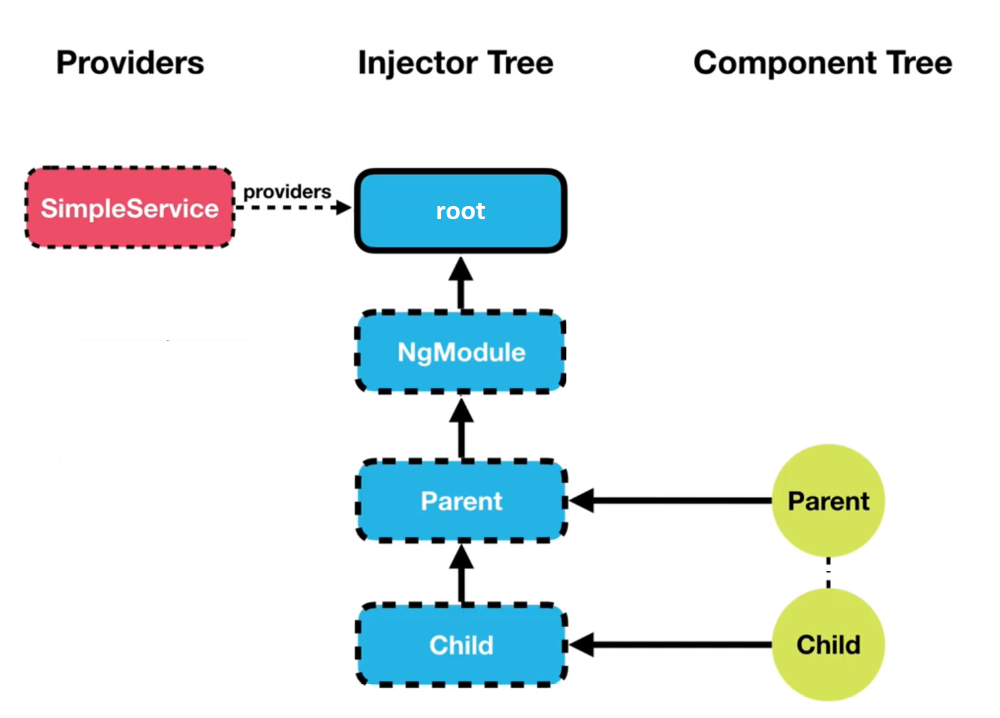

<!-- .slide -->
# Principle of DI in Angular

- The <b>3 main concepts</b>
    - The Injector
    - The DI Token (DI: Dependency Injection)
    - The Provider

##==##

<!-- .slide -->
# The Injector

- Responsibilities:
    - <b>Create instances</b> of dependencies. (with the help of <b>Providers</b>)
    - Keep instances of dependencies in its <b>"cache"</b>
    - <b>Make available</b> the dependencies to the classes that request them.

##==##

<!-- .slide -->
# The Injector

- You don't have to create an injector by yourself
- There are <b>2 injector hierarchies</b> in your application:
    - the <b>ModuleInjector</b>: implicitly created for each module + 1 injector called "root"
    - the <b>ElementInjector</b>: implicitly created for each DOM element (component)
- Each Injector contains (or not) a singleton of a dependency, and can inject this instance into several components or services.

##==##

<!-- .slide -->
# The DI Token

- Responsibilities:
    - Allows to <b>identify</b> a dependency. (KEY)
    - When a dependency injection is requested, the injector will use the token to check if a dependency is available and if it can create it. (<KEY/VALUE>)

##==##

# The Provider

- Responsibilities:
    - Allows to define <b>how</b> to obtain a dependency associated with a DI Token.
    - A provider is defined for <b>one</b> injector and it will be used by the latter to create the dependencies.

##==##
<!-- .slide -->
# Principle of DI in Angular



##==##

<!-- .slide -->
# How to configure these 3 concepts

- Injector & Provider:
  - <b>providedIn</b> property of the <b>@Injectable</b> decorator
  - <b>providers: []</b> property of the <b>@NgModule, @Component, @Directive, @Pipe</b> decorators
- Token:
  - implicit (most of the time)
  - or via the <b>@Inject</b> decorator

##==##

<!-- .slide: class="two-column-layout" -->
## Injector Types: ModuleInjector

<!-- .slide: class="with-code inconsolata" -->

```typescript
@NgModule({
  imports: [
    ...
  ],
  declarations: [PeopleAppComponent],
  providers: [ItemService],
  bootstrap: [PeopleAppComponent]
})
export class ItemModule {}
```

<!-- .element: class="medium-code" -->

```typescript
import { Injectable } from '@angular/core';
@Injectable()
export class ItemService {
    name = 'telephone';
}
```

<!-- .element: class="medium-code" -->

##--##

<!-- .slide: class="with-code inconsolata" -->

```typescript
@NgModule({
  imports: [
    ...
  ],
  declarations: [PeopleAppComponent],
  bootstrap: [PeopleAppComponent]
})
export class ItemModule {}
```

<!-- .element: class="medium-code" -->

```typescript
import { Injectable } from '@angular/core';
@Injectable({
    providedIn: ItemModule // <--provides this service in the ItemModule ModuleInjector
})
export class ItemService {
    name = 'telephone';
}
```

<!-- .element: class="medium-code" -->

##==##

<!-- .slide: class="with-code inconsolata" -->
# Injector Types: ModuleInjector

- For each application, there is a ModuleInjector called <b>'root'</b> at the top of the hierarchy

```typescript
import { Injectable } from '@angular/core';
@Injectable({
    providedIn: 'root' // <--provides this service in the root ModuleInjector
})
export class ItemService {
    name = 'telephone';
}
```

<!-- .element: class="big-code" -->

##==##
<!-- .slide: class="two-column" -->
## Hierarchy Injection



##--##
<!-- .slide: class="with-code inconsolata" -->

```typescript
import { NgModule } from '@angular/core';
@NgModule({
  providers: [SimpleService]
})
export class ItemsModule {
    name = 'telephone';
}
```

<!-- .element: class="medium-code" -->

##==##

<!-- .slide: class="two-column" -->
## Hierarchy Injection



##--##
<!-- .slide: class="with-code inconsolata" -->

```typescript
@Component({
  selector: 'parent',
  templateUrl: 'parent.component.html',
  styleUrls: ['parent.component.css'],
  providers: [SimpleService]
})
export class ParentComponent { ... }
```

<!-- .element: class="medium-code" -->

##==##

<!-- .slide: class="two-column" -->
## Hierarchy Injection



##--##
<!-- .slide: class="with-code inconsolata" -->

```typescript
import { Injectable } from '@angular/core';
@Injectable({
    providedIn: 'root' // <--provides this service in the root ModuleInjector
})
export class SimpleService {
    name = 'telephone';
}
```

<!-- .element: class="medium-code" -->

##==##

<!-- .slide: class="sfeir-basic-slide" -->
# Zoom on `providers = []`

- Links <b>InjectionToken</b> (token) and a <b>Factory</b>
- Allows decoupling the dependency and its implementation

##==##

<!-- .slide: class="with-code inconsolata" -->
# Zoom on `providers = []`

- This expression is a shortcut:

```typescript
providers: [MyService]
```

<!-- .element: class="big-code" -->

- It is equivalent to writing:

```typescript
providers: [ { provide: MyService, useClass: MyService }]
```

<!-- .element: class="big-code" -->

##==##

<!-- .slide -->
# The different types of resolution

- Value
- Alternative class
- Aliased classes
- Factory
